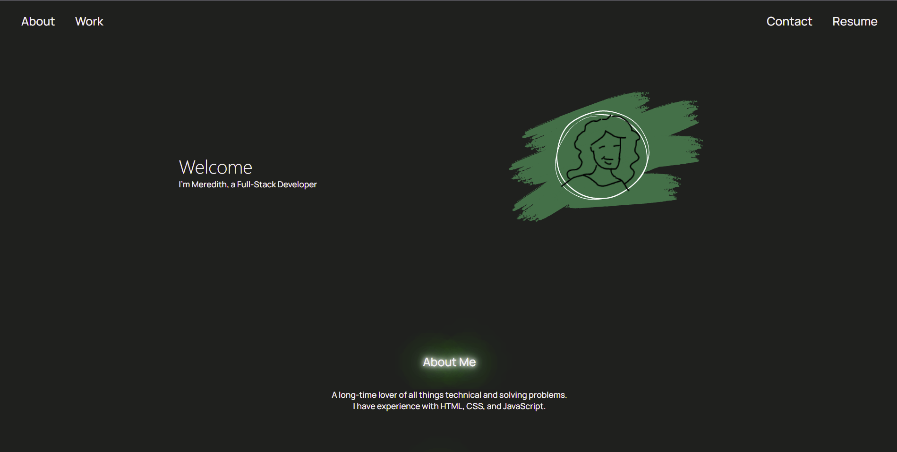

# meredith-mccollum-portfolio

## Description

This portfolio was created to showcase my own best works for future employment and to show personal progress in my coding journey. When I envisioned my portfolio I wanted it clean and glowing with just a small a bit of charm thrown in - something I hope anyone finds in my work.

## Technology 
This portfolio is built soley on:

HTML, 
CSS

## Links:
 Github Repository: https://github.com/MAMcC0/meredith-mccollum-portfolio

Live Website: https://mamcc0.github.io/meredith-mccollum-portfolio/

## Credits

The glow effect was adapted from a neon tutorial from Silvia O'Dwyer on CSS-Tricks
 website here: https://css-tricks.com/how-to-create-neon-text-with-css/ , accessed May 2022